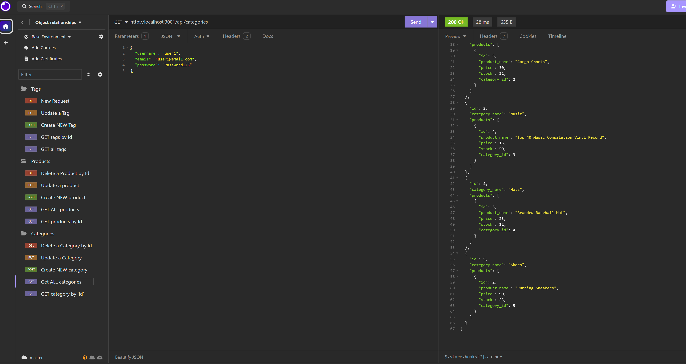

# Object-Relational-Mapping / E-Commerce Back-End

## Description:
This application was finished and corrected, to be able to manage the database from diferent products inside a clothing store.

This works mainly thanks to different route connections and by using its corresponding request, the manager of the store can easily visualize the Items, Categories and Tag's of each product; and can also Add, Update or Delete any of those items mentioned before.

This application works by using some important **dependencies** like: *dotenv*, *express*, *mysql2*, and *sequelize*

## Running the project:
To Install and Run the project, first you will need to open the integrated terminal and start the session inside *"mysql"*, by using the command *"mysql -u root -p"*, (you may need to modify your '.env' file with your personal information), after entering your password, you need to *"SOURCE"* the 'schema' file to create the table, exit 'mysql', and run *"npm run seed"* , to populate the tables, and then start the server by running the command *"npm start"*.

After the server is listening and running, you can proceed to open the localhost in the application of your preference (like **Insomnia** in this case). And you can proceed to use each endpoint and JSON request to do any action that you want to complete.

## Application img. example (running in Insomnia):

### Developer info:

GitHub Repository: https://github.com/BryanGC96/Object-Relational-Mapping 

Running application video example: https://drive.google.com/file/d/11eCimYyPwh5OiwC109B9FBXH6dL3i3An/view?usp=sharing 
